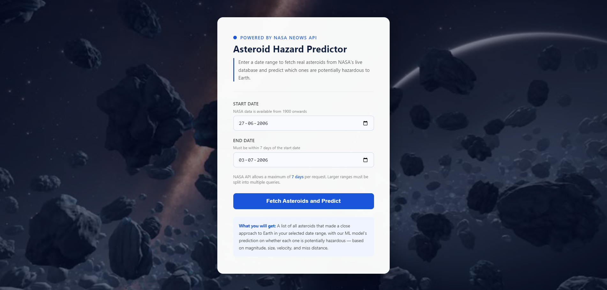
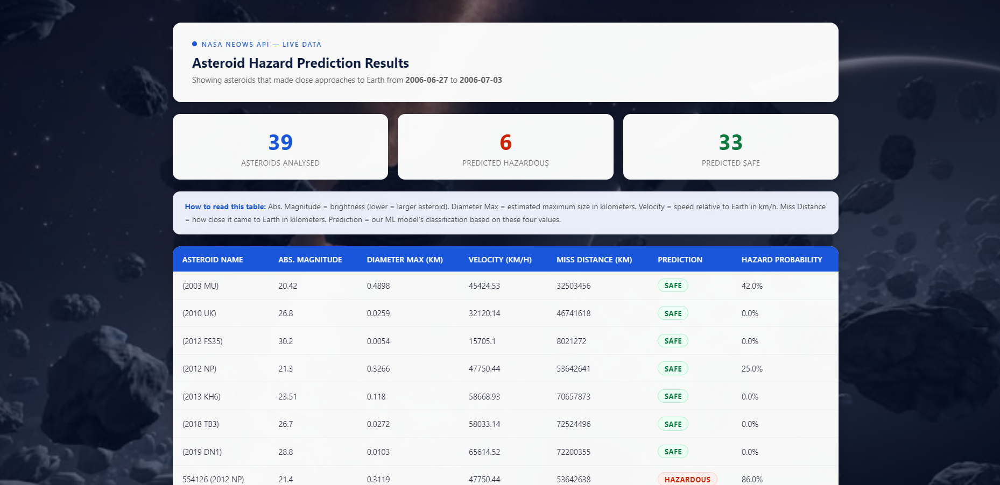

# Asteroid Hazard Prediction

A production-deployed machine learning application that predicts whether near-Earth asteroids are potentially hazardous, using live orbital data from NASA's NeoWs API.

**Live Demo:** [asteroid-hazard-prediction.onrender.com](https://asteroid-hazard-prediction.onrender.com/)

---

## Project Overview

Most ML projects train and predict on the same static dataset. This project separates training from inference:

- **Training:** Historical Kaggle CSV — 338,000 asteroid records (1910–2024)
- **Inference:** NASA NeoWs REST API — the Flask app fetches real asteroids for any date range the user enters and runs live predictions

The model classifies asteroids as `HAZARDOUS` or `SAFE` based on four physical and orbital features. The primary challenge is class imbalance: 87.2% of asteroids are not hazardous, making accuracy a misleading metric. F1-score on the hazardous class is the primary evaluation metric.

---

## Screenshots

### Home Page


### Prediction Results


---

## Key Features

- Live NASA API integration — predictions on real, current asteroid data
- End-to-end ML pipeline: ingestion, transformation, SMOTE oversampling, training, and inference
- Experiment tracking with MLflow on DagsHub
- Data drift monitoring with Evidently
- Model artifacts stored and versioned on Hugging Face Hub
- Containerized with Docker and deployed on Render

---

## Model Performance

| Model | F1 (Hazardous) | Recall | Precision |
|---|---|---|---|
| Logistic Regression | 0.4583 | 0.8773 | 0.3101 |
| **Random Forest** | **0.6606** | **0.7194** | **0.6107** |
| Gradient Boosting | 0.4841 | 0.9789 | 0.3216 |
| XGBoost | 0.4878 | 0.9870 | 0.3239 |
| CatBoost | 0.5000 | 0.9588 | 0.3382 |

Random Forest was selected — it is the only model where Precision exceeded 0.60, meaning it actually discriminates between classes rather than flagging most asteroids as hazardous.

> **Deployment note:** The production model on Render runs with `n_estimators=10` (reduced from 100) to fit within the 512MB RAM constraint on the free tier. This brings F1 down from 0.6606 to 0.6466. To reproduce the full model, retrain locally using `main.py` — no code changes required.

---

## Tech Stack

| Layer | Tool |
|---|---|
| ML | Scikit-learn |
| Data | Pandas, NumPy |
| Imbalance Handling | imbalanced-learn (SMOTE) |
| Experiment Tracking | MLflow + DagsHub |
| API Integration | NASA NeoWs REST API |
| Monitoring | Evidently |
| Web App | Flask |
| Model Storage | Hugging Face Hub |
| Containerization | Docker |
| Deployment | Render |

---

## Project Structure

```
asteroid_hazard_prediction/
├── src/
│   ├── components/
│   │   ├── data_ingestion.py
│   │   ├── data_transformation.py
│   │   ├── model_trainer.py
│   │   └── model_monitoring.py
│   ├── pipeline/
│   │   ├── training_pipeline.py
│   │   ├── prediction_pipeline.py
│   │   └── monitoring_pipeline.py
│   ├── logger.py
│   ├── exception.py
│   └── utils.py
├── notebook/
│   ├── 01_EDA.ipynb
│   └── 02_model_experiment.ipynb
├── templates/
│   ├── index.html
│   └── results.html
├── assets/
│   ├── home.png
│   └── results.png
├── app.py
├── main.py
├── Dockerfile
├── requirements.txt          # Full dependencies — use this for local development and training
└── requirements-prod.txt     # Slim dependencies — used by Docker for production only
```

---

## Installation

### Prerequisites

- Python 3.10
- A free NASA API key from [api.nasa.gov](https://api.nasa.gov)
- A DagsHub account for MLflow experiment tracking

### 1. Clone the repository

```bash
git clone https://github.com/ziyadshaikh-cook/Asteroid_hazard_prediction.git
cd Asteroid_hazard_prediction
```

### 2. Create environment

```bash
conda create -p venv python=3.10 -y
conda activate ./venv
pip install -r requirements.txt
pip install -e .
```

> Use `requirements.txt` for local development and training. The file `requirements-prod.txt` is only used by Docker during deployment — do not use it for local setup.

### 3. Set up environment variables

Create a `.env` file at the root of the project:

```
NASA_API_KEY=your_nasa_api_key
DAGSHUB_TOKEN=your_dagshub_token
```

Get a free NASA API key at [api.nasa.gov](https://api.nasa.gov). One key works across all NASA APIs.

### 4. Download the dataset

Download from Kaggle: [NASA Nearest Earth Objects 1910-2024](https://www.kaggle.com/datasets/ivansher/nasa-nearest-earth-objects-1910-2024)

Place it at `data/raw.csv`.

### 5. Run the training pipeline

```bash
python main.py
```

This runs data ingestion, transformation, SMOTE, and model training. The trained model and preprocessor are saved to `artifacts/`.

### 6. Run the Flask app

```bash
python app.py
```

Open `http://localhost:5000`

---

## Docker

```bash
docker build -t asteroid-hazard .
docker run -e NASA_API_KEY=your_key -p 5000:5000 asteroid-hazard
```

---

## Usage

1. Open the app at the live URL or locally at `http://localhost:5000`
2. Enter a start date and end date — keep the range within 7 days (NASA API hard limit)
3. The app fetches real asteroid data from NASA's NeoWs API for that date range
4. The model classifies each asteroid as `HAZARDOUS` or `SAFE` with a probability score

---

## Key Design Decisions

**Why RobustScaler over StandardScaler?**
Diameter and velocity features are heavily right-skewed with outliers. RobustScaler uses median and IQR instead of mean and standard deviation, making it more resistant to extreme values.

**Why SMOTE after scaling?**
SMOTE generates synthetic minority-class samples by interpolating between existing points. Applying it before scaling would interpolate in the wrong feature space and distort the synthetic samples. Scale first, then SMOTE.

**Why not use the live NASA API for training?**
The API returns a maximum 7-day window per call. Collecting 338,000 records would require hundreds of calls over hours. The Kaggle CSV is the same data pre-collected — used for training, the live API is used only for inference.

---

## Experiment Tracking

All model runs are logged to DagsHub:
[dagshub.com/ziyadshaikh-cook/Asteroid_hazard_prediction.mlflow](https://dagshub.com/ziyadshaikh-cook/Asteroid_hazard_prediction.mlflow)

---

## Future Enhancements

- Upgrade to a paid Render tier to deploy the full 100-estimator model and restore F1 to 0.66
- Add frontend date validation to enforce the 7-day NASA API limit before form submission
- Extend the feature set using additional orbital parameters available from the NASA API
- Automate retraining when data drift is detected by the Evidently monitoring pipeline

---

## License

MIT License

---

## Acknowledgements

- [NASA NeoWs API](https://api.nasa.gov/) for live near-Earth object data
- [Kaggle — NASA Nearest Earth Objects 1910-2024](https://www.kaggle.com/datasets/ivansher/nasa-nearest-earth-objects-1910-2024) for the training dataset
- [DagsHub](https://dagshub.com/) for MLflow experiment tracking
- [Hugging Face Hub](https://huggingface.co/) for model artifact storage